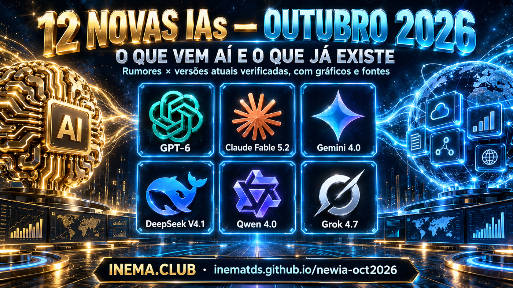

# 12 Novas IAs — Outubro 2026

[](https://inematds.github.io/newia-oct2026/guia/)

Dossiê de pesquisa sobre as **12 IAs anunciadas (como rumor) para outubro de 2026** — GPT Bel, GPT-6 Sol,
Claude Fable 5.2, Claude Opus 5.1, Grok 4.7, DeepSeek V4.1 Pro, GLM-5.5, Kimi K3.1, Qwen 4.0, Gemini 4.0,
Muse Spark 1.4 e Xiaomi MiMo-V3 — cada um comparado com a **versão atual verificada** da sua linhagem
(preço, contexto, benchmarks, linha do tempo), com fontes, gráficos e leitura de utilidade prática.

Estado da pesquisa: **2026-09-15**. Rumor e fato ficam separados: todo número tem URL-fonte; sem URL vira
`não verificado`.

## 📖 Página do projeto

Landing + dossiê completo, com gráficos: **https://inematds.github.io/newia-oct2026/guia/**

## Estrutura

| Caminho | O que é |
|---|---|
| `modelos/<slug>.md` | Um dossiê por modelo (linhagem, versão atual verificada, linha do tempo, rumor, o que muda, utilidade, fontes, JSON estruturado). |
| `data/modelos.json` | Dados estruturados extraídos dos 12 dossiês (gerado). |
| `guia/index.html` | Página única, self-contained, com gráficos SVG (gerada). |
| `scripts/extrai-dados.mjs` | Lê os blocos JSON dos markdowns e grava `data/modelos.json`. |
| `scripts/gera-pagina.mjs` | Renderiza `guia/index.html` a partir dos markdowns + JSON. |
| `capa/capa.png` | Capa oficial INEMA (catálogo). |

## Atualizar quando outubro chegar

1. Edite o dossiê do modelo em `modelos/<slug>.md` (texto e o bloco JSON no fim — mude `status` para `anunciado` ou `lancado`).
2. Regenere e publique:

```bash
node scripts/extrai-dados.mjs && node scripts/gera-pagina.mjs
git add -A && git commit -m "dossiê: <modelo> atualizado" && git push
```

## Os 12 dossiês

| Rumor | Dossiê |
|---|---|
| GPT Bel | [modelos/gpt-bel.md](modelos/gpt-bel.md) |
| GPT-6 Sol | [modelos/gpt-6-sol.md](modelos/gpt-6-sol.md) |
| Claude Fable 5.2 | [modelos/claude-fable-5-2.md](modelos/claude-fable-5-2.md) |
| Claude Opus 5.1 | [modelos/claude-opus-5-1.md](modelos/claude-opus-5-1.md) |
| Grok 4.7 | [modelos/grok-4-7.md](modelos/grok-4-7.md) |
| DeepSeek V4.1 Pro | [modelos/deepseek-v4-1-pro.md](modelos/deepseek-v4-1-pro.md) |
| GLM-5.5 (Z.AI) | [modelos/glm-5-5.md](modelos/glm-5-5.md) |
| Kimi K3.1 | [modelos/kimi-k3-1.md](modelos/kimi-k3-1.md) |
| Qwen 4.0 | [modelos/qwen-4.md](modelos/qwen-4.md) |
| Gemini 4.0 | [modelos/gemini-4.md](modelos/gemini-4.md) |
| Muse Spark 1.4 | [modelos/muse-spark-1-4.md](modelos/muse-spark-1-4.md) |
| Xiaomi MiMo-V3-Pro / Flash | [modelos/xiaomi-mimo-v3.md](modelos/xiaomi-mimo-v3.md) |

---

Projeto da comunidade **[INEMA.CLUB](https://inema.club)** · rumores não verificados independentemente.
